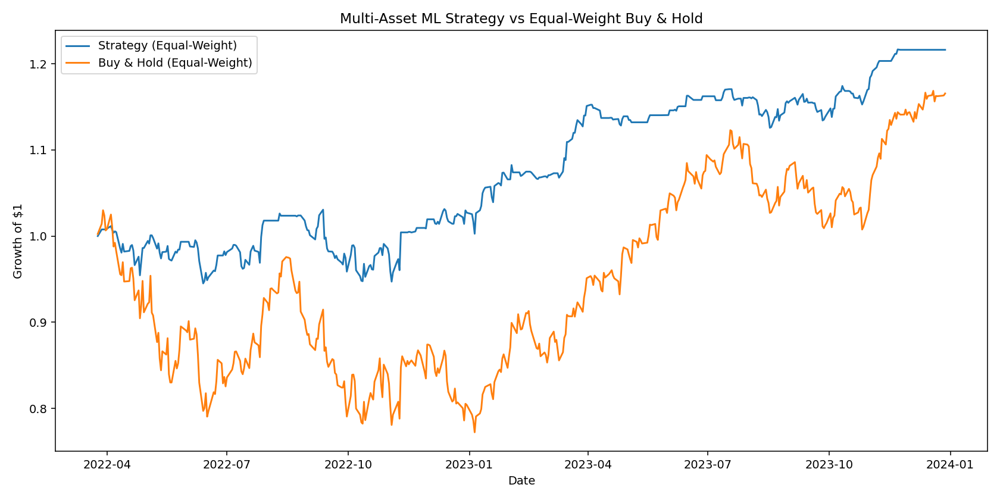

# 📈 Multi-Asset ML Trading Bot (XGBoost + LSTM)

A practical machine learning trading bot that uses **XGBoost classifiers** and **LSTM regressors** to generate next-day trading signals for multiple tickers, then backtests an **equal-weight portfolio strategy**.

It’s designed to be **simple enough to run locally**, but flexible enough to be extended for real-world experimentation.

---

## 🚀 Features

- **Per-ticker XGBoost Classifier** → Predicts next-day *up or down* movement.
- **Per-ticker LSTM Regressor** → Predicts the actual next-day *close price*.
- **Ensemble Model** → Combines the classifier and regressor into a single trading signal.
- **Equal-Weight Portfolio Backtest** → Aggregates per-ticker returns into a portfolio.
- **1-Bar Signal Lag** → Avoids look-ahead bias by shifting signals by one day.
- **Built-in Feature Engineering** → SMA, RSI, MACD, Volatility.
- **Transaction Cost Simulation** → Adjustable via CLI.
- **Result Exports** → Saves both CSV and equity curve plot.

---

## 📊 Example Output

```
Downloading: ['SPY', 'AAPL', 'MSFT']  2015-01-01→2023-12-31

[XGB] SPY accuracy: 0.517
[XGB] AAPL accuracy: 0.483
[XGB] MSFT accuracy: 0.533
[SIG] SPY: long-share=0.424 (xgb_any=True, lstm_any=True)
[SIG] AAPL: long-share=0.032 (xgb_any=True, lstm_any=True)
[SIG] MSFT: long-share=0.537 (xgb_any=True, lstm_any=True)
Saved: backtest_results.csv
Saved: equity_curve.png

=== Portfolio Backtest ===
Tickers:       SPY, AAPL, MSFT
Total Return:   21.62%
CAGR:           11.78%
Sharpe:          1.05
Max Drawdown:   -8.10%
Hit-Rate est.:  66.44%
```

---

## ⚙️ How It Works

1. **Data Download**  
   - Uses `yfinance` with dividend & split-adjusted prices.
   - Supported tickers: any symbol supported by Yahoo Finance.

2. **Feature Generation**  
   - **SMA10, SMA50**: Simple Moving Averages.  
   - **RSI14**: 14-period Relative Strength Index.  
   - **MACD / MACD Signal**: Moving Average Convergence Divergence.  
   - **Volatility20**: 20-day rolling volatility.

3. **Model Training**  
   - **XGBoost**: Binary classification of next-day up/down.  
   - **LSTM**: Regression for next-day close price.
   - Train/test split = 80% / 20%.

4. **Signal Generation**  
   - XGBoost: Long if P(up) ≥ 0.5.  
   - LSTM: Long if predicted close > today’s close.  
   - Ensemble: Weighted average of both (controlled by `--alpha`).

5. **Backtesting**  
   - Equal-weight allocation across tickers.  
   - 1-day delay between signal and execution.  
   - Transaction costs applied per trade.

---

## 📦 Installation

```bash
# Clone the repo
git clone https://github.com/YOUR_USERNAME/ml-trading-bot.git
cd ml-trading-bot

# Create a Python environment (recommended)
python3 -m venv .venv
source .venv/bin/activate

# Install dependencies
pip install -r requirements.txt
```

**requirements.txt**
```
numpy
pandas
matplotlib
yfinance
xgboost
scikit-learn
tensorflow
```

---

## 🖥️ Usage

Run with default tickers (SPY, AAPL, MSFT):

```bash
python tradingbot.py
```

Custom parameters:

```bash
python tradingbot.py \
  --tickers SPY,QQQ,TSLA \
  --start 2018-01-01 \
  --end 2024-12-31 \
  --tx_cost_bps 5 \
  --epochs 20 \
  --alpha 0.6
```

---

### CLI Arguments

| Argument         | Type    | Default             | Description |
|------------------|---------|---------------------|-------------|
| `--tickers`      | str     | `SPY,AAPL,MSFT`     | Comma-separated list of tickers. |
| `--start`        | str     | `2015-01-01`        | Start date for historical data. |
| `--end`          | str     | `2023-12-31`        | End date for historical data. |
| `--train_ratio`  | float   | `0.8`               | Train/test split ratio. |
| `--tx_cost_bps`  | float   | `0.0`               | Transaction cost in basis points. |
| `--seq_len`      | int     | `60`                | LSTM input sequence length. |
| `--epochs`       | int     | `30`                | LSTM training epochs. |
| `--batch_size`   | int     | `32`                | LSTM batch size. |
| `--alpha`        | float   | `0.5`               | Ensemble weight on XGB (0..1). |
| `--xgb_only`     | flag    | `False`             | Use only XGBoost model. |
| `--lstm_only`    | flag    | `False`             | Use only LSTM model. |
| `--out_csv`      | str     | `backtest_results.csv` | Output CSV file. |
| `--out_png`      | str     | `equity_curve.png`     | Output equity curve PNG. |

---

## 📁 Output Files

- **`backtest_results.csv`**  
  Daily strategy returns, buy-hold returns, equity curves per ticker.

- **`equity_curve.png`**  
  Visual comparison of portfolio strategy vs equal-weight buy & hold.

---

## 📈 Plot Example



---

## 🔍 Notes & Limitations

- This is a **research/educational tool**, not investment advice.  
- LSTM training can be **slow without GPU acceleration**.  
- Yahoo Finance data may occasionally have gaps or errors — check before trading.  
- Ensemble logic is simple; you can experiment with more advanced combination rules.  
- Only uses technical indicators — no fundamental or sentiment data.

---

## 📜 License

MIT License — feel free to use, modify, and distribute with attribution.

